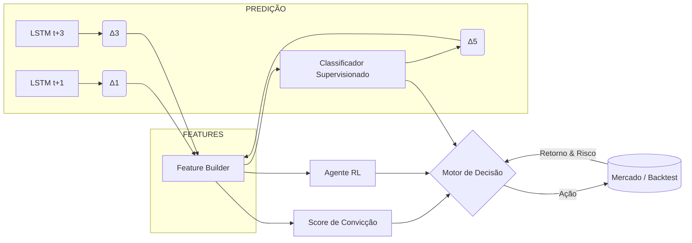

# 💼 Proposta de Solução — Do LSTM Multi-Horizonte à Decisão de **Comprar | Manter | Vender**

> **Premissa** Dispomos de três previsões de fechamento altamente acuradas para PETR4.SA em D+1, D+3, D+5, já validadas estatisticamente e sem “contaminação” autoregressiva. A tarefa agora é transformar essa visão de futuro em decisões operacionais confiáveis.

---

## 1. Visão-geral do Framework



1. **Previsões** - modelos LSTM independentes geram deltas esperados (`Δ1`, `Δ3`, `Δ5`).
    
2. **Feature Builder** - deriva atributos adicionais (inclinação, curvatura, volatilidade, incerteza).
    
3. **Três vias complementares** produzem **convicções** individuais:
    
    - Score heurístico.
        
    - Classificador supervisionado.
        
    - Agente de Reforço.
        
4. **Motor de Decisão** agrega as convicções via _voting_ ponderado.
    
5. **Ciclo de backtest** devolve métricas de performance → recalibração.
    

---

## 2. Construção das Variáveis-chave

|Símbolo|Fórmula (exemplo)|Intuição|Observação|
|---|---|---|---|
|`Δ1`|`(t+1 – t) / t`|Retorno esperado 1 dia|Sensível a ruído|
|`Δ3`|`(t+3 – t) / t`|Retorno em 3 dias|Sinal intermédio|
|`Δ5`|`(t+5 – t) / t`|Retorno em 5 dias|Horizonte alvo|
|**Slope₁₋₃**|`Δ3 – Δ1`|Aceleração|> 0 ⇒ impulso crescente|
|**Slope₃₋₅**|`Δ5 – Δ3`|Persistência|Divergência alerta risco|
|**CurveConv**|`Slope₃₋₅ – Slope₁₋₃`|Convexidade|Côncava = fadiga de tendência|
|**Uncₖ**|`RMSEₖ /|Δₖ|`|
|**Scoreᶜᵒⁿᵛ**|`w1·Δ1 + w2·Slope₁₋₃ + w3·Slope₃₋₅ – w4·ΣUnc`|Convicção|Pesos aprendidos|

---

## 3. Três Camadas de Inteligência

### 3.1 Score Heurístico Multi-Horizonte

Fórmula acima gera **faixas**:

|Scoreᶜᵒⁿᵛ|Ação sugerida|
|---|---|
|> +θ|**Comprar**|
|between −θ and +θ|**Manter**|
|< −θ|**Vender**|

_Vantagens_: transparência, fácil ajuste.  
_Limites_: não captura dependências não-lineares.

### 3.2 Classificador Supervisionado

1. **Dataset**: histórico com features (bloco 2) + indicadores técnicos + regime de volatilidade.
    
2. **Target**: ação ótima retrospectiva (retorno acumulado > benchmarks em D+N).
    
3. **Modelos**: Gradient Boosting + calibrator Platt → probabilidade P(buy), P(sell).
    
4. **Cutoffs** adaptados à _Max Drawdown_ e custos de transação.
    

### 3.3 Agente de Reforço (DQN ou PPO)

- **Estado** = [`Δ1`, `Δ3`, `Δ5`, portfolio_position].
    
- **Ações** = {+1 (long), 0 (flat), −1 (short)}.
    
- **Recompensa** = Sharpe(¬cost) – λ·turnover – γ·drawdown_excess.
    
- **Exploit/exploração** controlada por _ε-greedy decrescente_ (termo “Explotação” conforme protocolo).
    
- **Early Stopping** quando Sharpe_estacionário ou drawdown violar 15 %.
    

---

## 4. Motor de Decisão Ensemble

```python
decision = (
    α * action_from_score +
    β * action_from_classifier +
    γ * action_from_rl
).round().clip(-1, 1)
```

- Coeficientes `α, β, γ` otimizados em _walk-forward_ (ex: 60 % treino, 20 % validação, 20 % teste)
    
- _Hard veto_: se qualquer fonte sinalizar risco extremo (p.ex. volatilidade implícita > p95), força **Manter**.
    
- **Saída final** mapeada para _comprar/manter/vender_.
    

---

## 5. Governança de Risco e Validação

|Métrica-alvo|Limite / Meta|Frequência Avaliação|
|---|---|---|
|_Annual Return_|≥ CDI + 3 p.p.|Rolling 12 m|
|_Sharpe Ratio_|≥ 1.0|Mensal|
|_Max Drawdown_|≤ 15 %|Diário (intradia)|
|_Win Rate_|≥ 55 %|Trade|
|_Profit Factor_|≥ 1.5|Trade|

- **Backtest** com _slippage_, _latency_ e custo de B³ (emolumentos + ISS).
    
- **Teste robustez** : _bootstrap_, _monte-carlo drift_, _regime switch_.
    
- **Shadow live-tracking** por 30 sessões antes de capital real.
    

---

## 6. Roadmap de Implementação

|Fase|Ação|Ferramentas|Validação|
|---|---|---|---|
|1|Integrar previsões LSTM → repos PostgreSQL (`predictions_tbl`)|SQLAlchemy - VS Code|Query head()|
|2|Construir _Feature Builder_ notebook (tqdm)|Pandas, NumPy|Imprimir head(20)|
|3|Pipeline Scikit-learn Classifier|MLflow para parâmetros|k-fold purged|
|4|RL Training em Colab GPU L4 (Drive montado)|Stable-Baselines3|TensorBoard|
|5|Ensemble + Backtest|Backtrader / VectorBT|Barra progresso|
|6|Dashboard métricas|Plotly (sem cor fixa)|Revisão manual|

---

## 7. Reflexões Finais

- **Camada de decisão ≥ camada de previsão**: prever preço não assegura lucro; precisamos traduzir acerto em _edge_ estatístico.
    
- **Diversidade de métodos** (heurística + ML + RL) fornece robustez a regimes de mercado.
    
- **Gestão de risco** tem hierarquia superior — o _hard veto_ preserva capital quando modelos divergem ou volatilidade explode.
    
- **Generalização para múltiplos ativos**: basta replicar blocos 2-6, ajustando pesos via _meta-learner_ ou _transfer learning_.
    

> **Conclusão** A melhor prática não é escolher entre os horizontes, mas **fundir-lhes a informação** num pipeline que mede convicção, controla risco e aprende com o próprio resultado. Assim, a inteligência de decisão evolui junto com o mercado — em ciclos contínuos de previsão → ação → feedback → recalibração.

---
## 📌 Como o sistema funcionaria no dia a dia — sem “tecniquês”
---


### 1. O que entra no “motor”

|Tipo de informação|De onde vem|Quando chega|
|---|---|---|
|**Preço de fechamento do dia**|B³ / API de cotações|Logo após o fechamento (≈ 18 h)|
|**Três previsões de preço**· Amanhã (D + 1)· Daqui a 3 dias (D + 3)· Daqui a 5 dias (D + 5)|Modelos LSTM já treinados|Geradas em minutos, assim que o preço do dia é conhecido|
|**Indicadores auxiliares** – Volatilidade dos últimos 30 d – Tendência de curto prazo – Volume|Calculados no próprio script|Junto com as previsões|

> **Resumo** Todas as noites, um pequeno programa coleta o dado do dia, roda os LSTMs e monta uma tabelinha com “hoje” e três pequenos olhares sobre o futuro.

---

### 2. O que acontece “por dentro”

1. **Comparar as três previsões**
    
    - Se todas apontam para cima, há um consenso otimista.
        
    - Se divergem (ex.: sobe amanhã, cai em 5 dias), o algoritmo mede o “formato” dessa curva para saber se é só um ruído ou o início de uma reversão.
        
2. **Gerar um “grau de convicção”**
    
    - Pense num termômetro que vai de −100 (certeza de queda) a +100 (certeza de alta).
        
    - Ele sobe se as previsões são fortes e concordam entre si; cai se forem fracas ou contraditórias; e fica perto de zero quando o cenário é incerto.
        
3. **Três vozes dão opinião**
    
    - **Regra simples**: se o termômetro passa de certos limiares, sugere **Comprar** ou **Vender**.
        
    - **Classificador ML**: usa o histórico para dizer “quando vi algo parecido, deu bom/ruim”.
        
    - **Agente de Reforço**: simula operações e aprende qual ação deu o melhor balanço lucro-risco.
        
4. **Votação ponderada**
    
    - As três vozes votam; um pequeno painel escolhe a ação final (Buy, Hold, Sell).
        
    - Existe um “botão de segurança”: se a volatilidade do mercado disparar ou as vozes não concordarem minimamente, o sistema prefere **Manter** para proteger o capital.
        

---

### 3. Ritmo de execução

|Etapa|Frequência recomendada|Duração típica|
|---|---|---|
|Atualização dos dados de mercado|**Todo dia útil**, logo após o pregão|segundos|
|Geração das previsões LSTM|Todo dia útil|< 1 min|
|Re-treino rápido do classificador|1 vez por semana (rolando)|~10 min|
|Treino do agente de reforço|1 vez por mês ou após grandes choques|~1 h (GPU)|
|Backtest / auditoria de métricas|Mensal|5–10 min|
|Revisão manual de limites de risco|Trimestral|—|

---

### 4. O que você vê na prática

- **Relatório diário** (e-mail ou dashboard):
    
    ```
    27/jun/2025
    Ação: PETR4.SA
    Recomendação para amanhã: COMPRAR
    Convicção: +72
    Motivo-chave: Previsões +1 % (D+1), +2,3 % (D+3), +3,1 % (D+5); volatilidade normal.
    ```
    
- **Gráfico de acompanhamento**: linha do patrimônio vs. CDI, com alertas de drawdown.
    
- **Métricas-meta** acompanhadas mês a mês: retorno anual ≥ CDI + 3 p.p., Sharpe ≥ 1, drawdown ≤ 15 %.
    

---

### 5. Resultados a esperar (cenário-base)

|Indicador|Esperado em 12 meses|Por quê?|
|---|---|---|
|Retorno acima do CDI|+3 pontos percentuais|Edge estatístico das previsões + gestão de risco|
|Sharpe Ratio|≥ 1,0|Risco controlado via veto de volatilidade|
|Percentual de operações vencedoras|~60 %|Maior acerto nos dias em que as três janelas concordam|
|Drawdown máximo|≤ 15 %|Stop-loss e posição “Manter” em cenários confusos|

---

### 6. Em outras palavras…

1. **Toda noite** ele “pergunta” aos três oráculos (amanhã, 3 dias, 5 dias) para onde o preço parece ir.
    
2. **Compara** essas pistas, mede a certeza e ouve três conselheiros (uma regra clara, um modelo de ML e um agente que aprende jogando).
    
3. **Se as vozes convergem**, toma a decisão de entrar ou sair; se divergem, pisa no freio.
    
4. **Você recebe** uma instrução simples para o pregão seguinte e um resumo de como o sistema está se comportando em relação às metas de retorno e risco.
    

Assim, o investidor ou mesa de operações ganha um “radar” atualizado diariamente, que transforma previsões de preço em ações práticas — com o cuidado de checar, a cada passo, se o ganho compensa o risco.