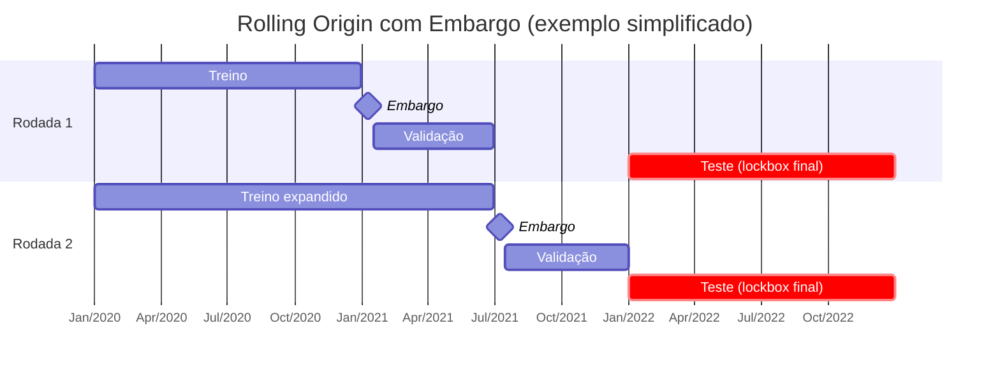

Mudando para modo THINKING, como solicitado.

# Análise: como dividir os dados dado o objetivo D+1/D+3/D+5

## 1) Objetivo e implicações

Você quer previsões ex-ante para três horizontes (D+1, D+3, D+5), que alimentarão camadas decisórias posteriores. Isso exige:

- zero vazamento temporal,
    
- comparabilidade entre ativos (para que “choques de mercado” sejam aprendidos/avaliados de forma coerente),
    
- e trato justo para **ativos “late-born”** (com histórico menor).
    

## 2) Três estratégias e seus efeitos

### A) 70/20/10 por sorteio (aleatório)

- **Problema**: mistura janelas temporais; alto risco de **vazamento** (o modelo vê padrões do “futuro” no treino).
    
- **Consequência**: métricas **otimistas** e pouco transferíveis.  
    **Conclusão**: **descartar** para séries temporais.
    

### B) Split temporal por **percentual por ticker** (70/15/15, sem alinhamento global)

- **Pró**: respeita o tempo; simples; usa o máximo de dados de cada ativo.
    
- **Contra**: eventos sistêmicos (ex.: crash amplo) **entram em fases diferentes** entre ativos; comparabilidade cai. O modelo aprende padrões de regimes, mas a **validação** entre ativos fica desalinhada.
    
- **Uso**: aceitável para um primeiro treino único multiativo; **fraco** para avaliação comparável entre ativos e para medir resposta a choques amplos.
    

### C) Split temporal por **datas globais alinhadas** (mesmos cortes para todos)

- **Pró**: comparabilidade alta; “efeitos de mercado” entram **na mesma fase** para todo mundo; avaliação coerente.
    
- **Contra**: “late-born” terão menos amostras de treino; a **interseção de calendários** pode reduzir o conjunto “estritamente comparável”.
    
- **Uso**: é o padrão mais **confiável** para validação/relato de resultados quando queremos medir aprendizado de **regimes do mercado**.
    

## 3) Recomendações (o que eu sugiro implementar)

### 3.1. Adotar **calendário global com cortes por data** (regra base)

- Definir dois marcos de corte **iguais** para todos os ativos: `train_end_date` e `val_end_date`.
    
- Critério sugerido: percentis sobre o **calendário comum** (ex.: 70% e 85%) ou datas alvo (ex.: por ano/mês), sempre respeitando **embargo ≥ h_max** (5 dias) para evitar “vazamento” do horizonte máximo.
    
- **Efeito**: eventos sistêmicos caem na mesma fase em todos os ativos; a comparação fica limpa.
    

### 3.2. Permitir **participação escalonada** dos “late-born”

- Um ativo que “nasce” depois do início do período **entra** quando passa a ter dados.
    
- Ele não “quebra” o alinhamento global; apenas **participa menos** em treino inicial, mas plenamente nas fases mais recentes.
    
- Registrar no manifesto a **matriz de participação** (quais ativos contribuem em cada fase).
    

### 3.3. Usar **Rolling Origin (expanding window) + embargo** para desenvolvimento

- Em vez de um único split, usar **várias dobras temporais** com janelas crescentes (treino expande, validação desliza), **sempre com os mesmos cortes globais** e **embargo** de 5–10 dias.
    
- **Benefício**: cada regime (pré-choque, choque, recuperação) aparece **ora no treino, ora na validação**, reduzindo o “viés de regime único”.
    
- Para o relatório final, manter um **lockbox** OOS (ex.: últimos 6–12 meses) **nunca tocado** durante desenvolvimento.
    

### 3.4. Dois conjuntos de métricas (para honestidade e utilidade)

- **Painel “Core” (interseção estrita)**: só datas presentes em **todos** os ativos.
    
    - Serve para **comparar ativos** sem viés de disponibilidade.
        
- **Painel “Full” (união)**: usa todos os dados disponíveis por ativo (com os mesmos cortes globais e embargo).
    
    - Serve para **aproveitar informação** e olhar “o que o modelo aprendeu” mesmo quando alguns ativos são mais novos.
        

### 3.5. Mecanismo de **checagem de alinhamento** (sem mudar código agora)

Para garantir “sempre a mesma data”:

1. **Tabela de calendário por ticker**
    
    - `min_date`, `max_date`, `n_total`.
        
    - Flags: `has_train_end_date`, `has_val_end_date`.
        
    - Ajustes tolerantes: se a data de corte não existir para um ticker, usar a **maior data ≤ corte** e registrar `cut_used_train`, `cut_used_val`.
        
2. **Relatório de participação**
    
    - Para cada dobra (se usar rolling), linhas por ticker com `n_train`, `n_val`, `n_test` e **embargo aplicado**.
        
3. **Auditoria de perdas**
    
    - Quantificar linhas excluídas por sair da interseção; listar top perdas por ticker.
        
4. **Modo Strict vs Tolerant**
    
    - **Strict**: exige que as datas exatas existam; se não, falha.
        
    - **Tolerant (recomendado)**: usa o “**nearest prior**” para cada corte e **log** do ajuste; mantém comparabilidade prática sem desperdiçar muito dado.
        

### 3.6. Parâmetros padrão que eu adotaria

- **Cortes globais**: 70% (train), 15% (val), 15% (test) por **data**, com **embargo = 5 dias** (≥ D+5).
    
- **Rolling**: 3–5 dobras, expandindo o treino e deslizando a validação, mantendo o **test final** como lockbox.
    
- **Regra de inclusão**: ativo entra na dobra apenas se tiver **mínimo de amostras** na janela (ex.: ≥ 200 linhas após embargo).
    
- **Escalonamento**: manter o **scaler global congelado** como baseline, mas registrar explicitamente que ele é **exógeno** ao split (e, quando quisermos apertar rigor máximo, opcionalmente re-treinar o scaler **só no treino** para eliminar qualquer risco de vazamento).
    

## 4) Conclusão operacional

- **Não** usar sorteio.
    
- **Sim** a cortes **iguais por data** para todos, com **embargo** e **rolling origin**.
    
- Lidar com “late-born” por **participação escalonada**, sem quebrar o alinhamento.
    
- **Relatar** resultados no painel **Core** (interseção) e **Full** (união), deixando claro o que é comparabilidade vs. aproveitamento de dados.
    
- Essa estratégia está **alinhada** ao desenho Prediction-First com camadas decisórias posteriores (incluindo RL), pois preserva regimes de mercado e fornece avaliação honesta e comparável entre ativos.
    

Se estiver de acordo, sigo com a especificação do **manifesto de splits** (campos e validações) e, depois, com a adaptação do pipeline para esses cortes globais com embargo.

# Orientações Internas para Execução em INSTANT

## 1. Contexto e Escopo

- Objetivo do pipeline: **previsões D+1, D+3, D+5** sobre tickers da B3.
    
- A previsão é **prediction-first**: serve como insumo para processos decisórios posteriores (ensemble, RL, camadas de risco).
    
- Todo split e treinamento deve respeitar:
    
    - **Ordem temporal** (sem vazamento).
        
    - **Embargo ≥ horizonte máximo (D+5)**.
        
    - **Rolling origin** quando apropriado, para capturar regimes diferentes.
        

## 2. Quando em INSTANT devo…

- **Responder de forma concisa e direta.**
    
- **Entregar código pronto para execução** (um comando por célula).
    
- **Validar cada passo com prints/resumos curtos** (shapes, contagens, caminhos de saída).
    
- **Não antecipar próximos passos**: só tratar do que já foi decidido e executado.
    
- **Checar sempre**: nomes de arquivos, caminhos e colunas contra o que já está validado.
    

## 3. Regras obrigatórias em splits

- Usar **datas globais alinhadas** como cortes (train_end, val_end).
    
- Aplicar **embargo de 5 dias** entre treino e validação/teste.
    
- Garantir **tabela de auditoria por ticker** com:
    
    - datas mínimas e máximas,
        
    - contagem por split,
        
    - flags de presença das datas de corte,
        
    - ajustes aplicados (strict/tolerant).
        
- Manifesto salvo em `/reports/manifests/`, com metadados completos.
    

## 4. Uso de “Strict vs Tolerant”

- **Strict**: exige que todos os tickers tenham a data de corte. Se falhar → erro explícito.
    
- **Tolerant (recomendado)**: aceita “nearest prior” para cortes; registra ajuste no manifesto.
    
- Sempre relatar no log/manifesto qual modo foi usado.
    

## 5. Estilo de Saída

- Para operações prolongadas: usar **tqdm** (barra de progresso).
    
- Para resultados: imprimir **resumo sucinto** (ex.: shapes dos tensores, nº de amostras por split).
    
- Para erros: falhar de forma **explícita e informativa**, nunca silenciosamente.
    

## 6. Checkpoints

- Sempre que houver risco de troca de chat/contexto: gerar **checkpoint disciplinado em Markdown** com:
    
    - Estado geral,
        
    - Decisões já tomadas,
        
    - Pendências abertas.
        

---