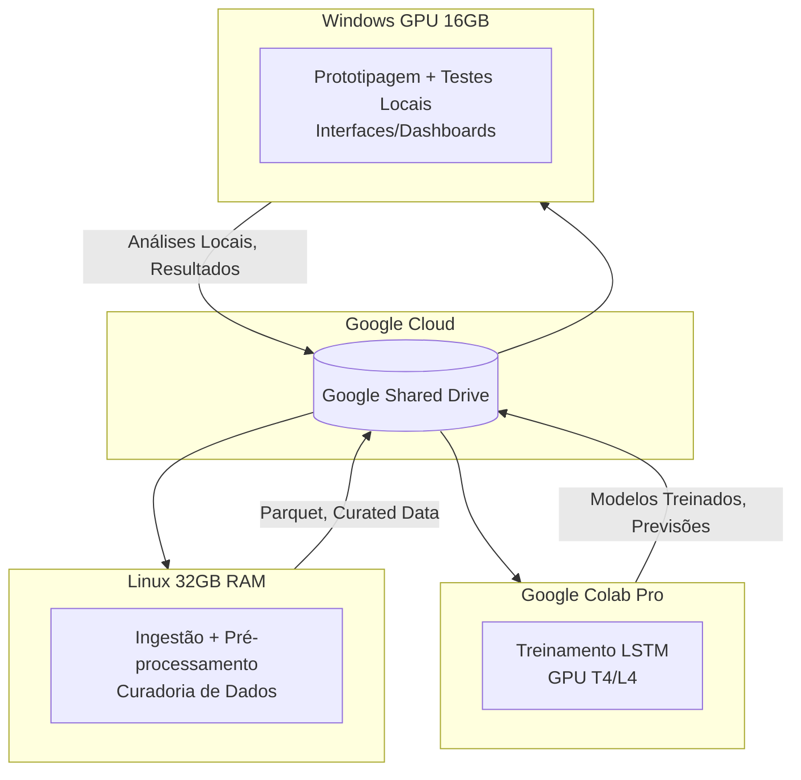

```mermaid
flowchart TD

    subgraph Cloud[Google Cloud]
        GDrive[(Google Shared Drive)]
    end

    subgraph Colab[Google Colab Pro]
        Train[Treinamento LSTM<br>GPU T4/L4]
    end

    subgraph Linux[
    Linux 32GB RAM]
        Preproc[Ingestão + Pré-processamento<br>Curadoria de Dados]
    end

    subgraph Windows[Windows GPU 16GB]
        Proto[Prototipagem + Testes Locais<br>Interfaces/Dashboards]
    end

    %% Fluxos
    Linux -->|Parquet, Curated Data| GDrive
    Colab -->|Modelos Treinados, Previsões| GDrive
    Windows -->|Análises Locais, Resultados| GDrive

    GDrive --> Linux
    GDrive --> Colab
    GDrive --> Windows

```
