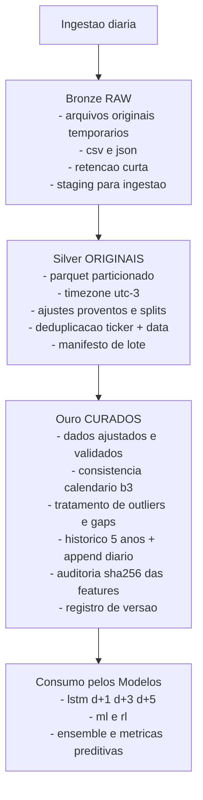

## 1. Objetivo

Definir fontes, formatos, granularidade, transformações e políticas de versionamento dos dados usados no **Framework Prediction-First + RL**, assegurando **consistência, reprodutibilidade e rastreabilidade** desde a ingestão até o consumo pelos modelos.

---

## 2. Fontes de Dados

- **Sandbox inicial (acadêmico):**
    
    - Yahoo Finance (tickers `.SA`).
        
    - APIs abertas (Alpha Vantage, Polygon, Twelve Data).
        
- **Fontes oficiais (futuras):**
    
    - B3 (boletins diários).
        
    - Provedores contratados (Economatica, Bloomberg, Refinitiv).
        
- **Metadados obrigatórios:**
    
    - Ajustes por dividendos/JCP.
        
    - Ajustes por splits/grupamentos.
        
    - Calendário oficial da B3 (feriados, pregões parciais).
        

---

## 3. Critério de Seleção Inicial

- Etapa exploratória com **4 ativos** para avaliar consistência.
    
- **PETR4** definido como baseline pelo volume, relevância setorial e qualidade do dado.
    
- Expansão gradual para demais ativos após validação da pipeline.
    

---

## 4. Ambiente de Trabalho

- **Execução:** Google Colab Pro (GPU/TPU).
    
- **Armazenamento:** Google Drive dedicado.
    
- **Pastas principais:**
    
    - `/dados/bronze/` → staging temporário (RAW).
        
    - `/dados/silver/` → originais deduplicados em Parquet.
        
    - `/dados/ouro/` → curados, validados e consumíveis.
        

---

## 5. Camadas de Dados

### Bronze (RAW)

- Arquivos originais em CSV/JSON.
    
- Retenção curta (descartados após ingestão).
    
- Sem auditoria persistente.
    
- Função: staging temporário para ingestão diária.
    

### Silver (ORIGINAIS)

- Dados convertidos em Parquet particionado.
    
- Deduplicação por **ticker + data** (e `source_id` se disponível).
    
- Ajustes por proventos e splits.
    
- Timezone unificado UTC-3.
    
- Manifesto de lote com auditoria leve (schema, contagem).
    

### Ouro (CURADOS)

- Dados ajustados e normalizados.
    
- Consistência com calendário oficial B3.
    
- Tratamento de outliers e gaps.
    
- Histórico mínimo de 5 anos + append diário.
    
- Auditoria: **SHA256 aplicado às features e schema**.
    
- Registro de versão e log de origem.
    
- Única camada consumida pelos modelos.
    

---

## 6. Granularidade

- **EOD (end-of-day)**, preços ajustados.
    
- Campos obrigatórios: data, abertura, máxima, mínima, fechamento ajustado, volume.
    
- Periodicidade: pregões regulares da B3.
    

---

## 7. Política de Versionamento

- **Bronze:** não versionado (descartável).
    
- **Silver:** versionado por lote com manifesto JSON.
    
- **Ouro:** versionado por ingestão incremental; auditoria SHA256 garante idempotência.
    
- **Regras:** cada modificação documentada (data, motivo, transformação).
    

---

## 8. Critérios de Aceite

- Ingestão mínima de **5 anos** por ativo.
    
- Zero gaps não explicados no calendário.
    
- Manifestos e auditoria válidos.
    
- Timezone consistente (UTC-3).
    

---

## 9. Fluxo Hierárquico de Dados (Mermaid)

---

%% **Rodapé de arquivamento**  
ESSE DOCUMENTO GERADO DEVE SER AGRUPADO NA PASTA CHAMADA `/docs/fase0/`.  
E REFERE-SE AO PONTO **F0.2** DO PLANO **MASTER PLAN GPT-5 v2**. %%

---

