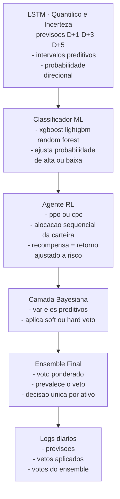

---

## 1. Objetivo

Definir a arquitetura de modelagem que sustenta o paradigma **prediction-first + RL**, descrevendo o papel de cada componente (Heurística, ML, RL, Bayesiana, Ensemble), bem como os critérios de integração.

---

## 2. Componentes de Modelagem

### 2.1 LSTM (Quantílico + Incerteza)

- **Função:** gerar previsões de retornos D+1, D+3 e D+5.
    
- **Configuração:**
    
    - LSTM quantílico (estimativa dos quantis 5%, 50%, 95%).
        
    - MC Dropout ou ensembles para capturar incerteza preditiva.
        
- **Saídas:**
    
    - Mediana dos retornos previstos.
        
    - Intervalos preditivos (PI).
        
    - Probabilidade direcional (p↑).
        
- **Papel no fluxo:** fornece a **visão central** e os intervalos de confiança para cada ativo.
    

### 2.2 Classificador Supervisionado (ML)

- **Função:** identificar padrões não lineares adicionais.
    
- **Exemplos de algoritmos:** XGBoost, LightGBM, Random Forest.
    
- **Entradas:** previsões LSTM + features de risco/mercado.
    
- **Saída:** probabilidade ajustada de alta/baixa.
    
- **Papel no fluxo:** atua como segundo avaliador, reforçando ou refutando o sinal da LSTM.
    

### 2.3 Agente de Reforço (RL)

- **Função:** otimizar a **alocação sequencial** da carteira.
    
- **Algoritmos candidatos:**
    
    - **PPO (Proximal Policy Optimization):** estável, adequado a políticas contínuas.
        
    - **CPO (Constrained Policy Optimization):** impõe limites explícitos de risco.
        
- **Recompensa:** retorno ajustado a risco, respeitando metas (≥ CDI+3%) e limites de perda.
    
- **Papel no fluxo:** distribui pesos entre os ativos elegíveis (10 core + reservas).
    

### 2.4 Camada Bayesiana

- **Função:** calcular risco de cauda ex-ante.
    
- **Métricas:** VaRpred_{pred}, ESpred_{pred}.
    
- **Papel no fluxo:** aplicar **soft/hard veto** quando o risco projetado ultrapassar limites.
    

### 2.5 Ensemble Final

- **Função:** combinar os sinais das quatro camadas anteriores.
    
- **Método:** voto ponderado; em caso de conflito, prevalece o veto (hard > soft > positivo).
    
- **Papel no fluxo:** gerar a **decisão única de cada ativo** (comprar, reduzir, manter, vender).
    

---

## 3. Integração dos Componentes

- Ordem do pipeline: **LSTM → ML → RL → Bayesiana → Ensemble**.
    
- Todos os sinais e métricas são **logados diariamente**.
    
- Decisões de alocação só são válidas quando passam por **todas as camadas**.
    

---

## 4. Critérios de Avaliação

- **Calibração:** cobertura dos intervalos preditivos (85–95%).
    
- **Qualidade probabilística:** CRPS e Winkler Score.
    
- **Robustez do ensemble:** consistência nas decisões em janelas consecutivas.
    
- **Risco:** verificação de orçamento global de ESpred_{pred}.
    

---

**Rodapé de arquivamento**  
ESSE DOCUMENTO GERADO DEVE SER AGRUPADO NA PASTA CHAMADA `/docs/fase0/`.  
E REFERE-SE AO PONTO **F0.3** DO PLANO **MASTER PLAN GPT-5 v2**.

---

